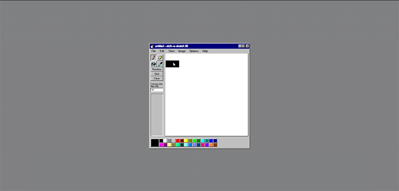
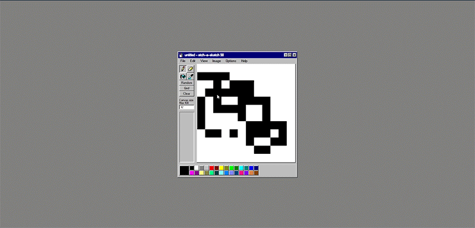
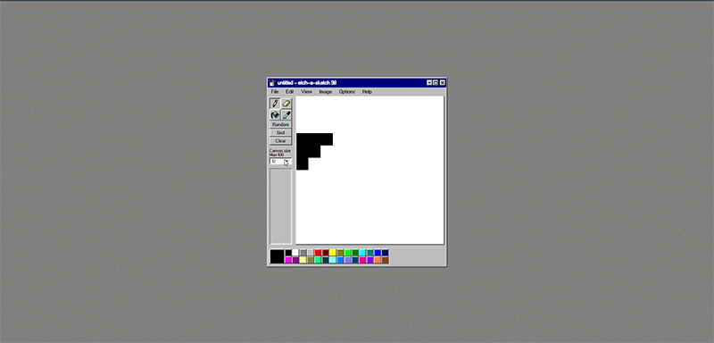

▶️ [Demo](https://github.com/LuxSolace/etch-a-sketch)

## 📄 Description
Une application d'*Etch-A-Sketch* réalisée dans le cadre de l'[Odin Project](https://www.theodinproject.com/lessons/foundations-etch-a-sketch). Pour son UI, j'ai cherché à reproduire le style de Paint 98 (il existe d'ailleurs une librairie CSS à cette fin, mais elle n'a pas été utilisée dans le cadre de ce projet). Si les tendances de design ont bien évolué depuis son époque, j'en reste toujours un peu nostalgique... 

- L'utilisateur peut dessiner à la souris sur la toile 
- Il peut également effacer ses traits avec la gomme, utiliser l'outil pot de peinture pour remplir la toile d'une même couleur et la pipette pour extraire une teinte précédemment utilisée
 

- En activant le bouton "Random", la teinte du pinceau change aléatoirement
- Le bouton Grid permet d'avoir une grille sur la toile
- Le bouton Clear remet la toile à 0

- L'utilisateur peut changer les dimensions de la toile en entrant un nombre dans l'input. Pour des raisons de performances, il est limité à 100*100 carrés.
- La palette en bas de l'écran est fonctionnelle. Ses couleurs sont celles de Paint 98.

## 🔨 Outils utilisés
- HTML
- CSS
- Javascript
